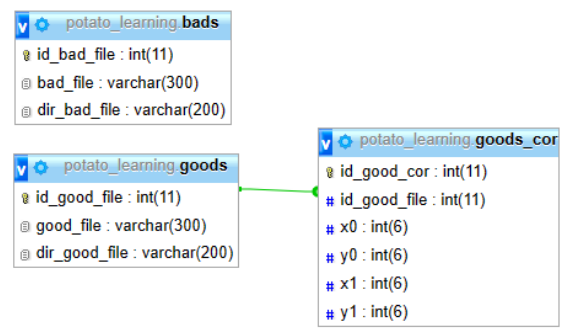

## _Помощник для организации хранилища для набора данных 									по компьютерному зрению для распознавания объектов_
Данный проект будет полезен тем, кто использует библиотеку для обработки изображений OpenCV. Благодаря оконному интерфейсу отбор, фильтрация и обработка изображений будут происходить быстрее.
## Возможности
- Скачивание изображений
- Отбор изображений на "хорошие" и "плохие"
- Выделение нужных объектов на "хороших" изображениях
- Формирование необходимых папок и файлов для работы библиотеки OpenCV
- Формирование файла-каскада, который будет использоваться для обнаружения объектов
- Поиск нужных объктов на изображении с помощью созданного каскада

## Установка

Для работы оконного интерфеса необходимо:
- [OpenCV](https://sourceforge.net/projects/opencvlibrary/files/opencv-win/2.4.9/) - библиотека алгоритмов компьютерного зрения, обработки изображений и численных алгоритмов общего назначения для обучения распознаванию объектов. Её можно скачать по ссылке, установка проста.
- База данных со структурой, представленной на изображении ниже

- Python и его библиотеки:
 -- Pillow
 -- os
 -- Requests
 -- BeautifulSoup4
 -- Tkinter
 -- Subprocess
 -- PyMySQL
 -- Matplotlib
 -- cv2

## Лицензия
Creative Commons Zero (CC0) — Отсутствие авторских прав